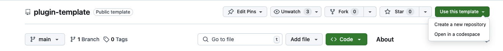
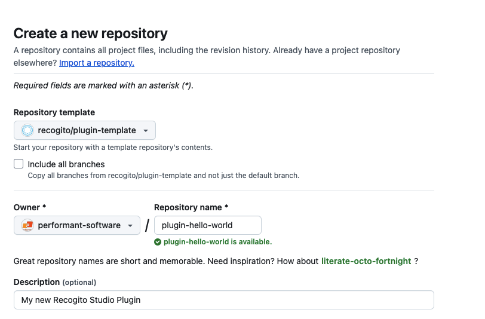
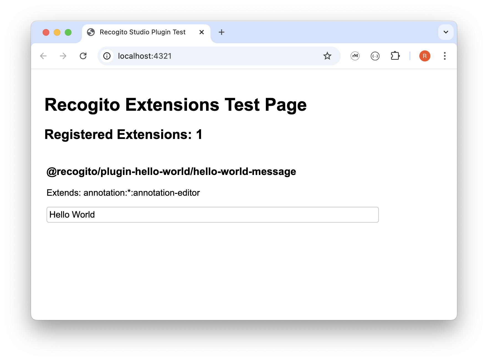

# Recogito Studio SDK

A software development kit for developing plugins to [Recogito Studio](https://recogitostudio.org/), an open source platform for collaborative annotation of TEI, IIIF and PDF documents.

## Introduction

The **Recogito Studio SDK** is designed to facilitate plugin development for the [Recogito Studio Client](https://github.com/recogito/recogito-client) without the need to set up your own full-stack installation or forking the platform. It provides essential tools and abstractions to help you build useful extensions for the Recogito Studio ecosystem.

### Astro Integrations

The Recogito Studio Client is an [Astro application](https://astro.build/). Recogito Studio plugins are implemented as [Astro Integrations](https://docs.astro.build/en/guides/integrations-guide/), which means they can leverage all the standard capabilities that Astro Integrations provide, plus some additional features introduced by Recogito Studio's own UI extension framework. (More on that below.)

### UI Extension Framework

Recogito Studio's built-in UI extension framework is based on [React’s lazy loading](https://react.dev/reference/react/lazy) and [Suspense](https://react.dev/reference/react/Suspense) mechanisms, and allows plugins to dynamically inject their own React components into defined **extension points** that the Recogito Studio Client defines. The SDK also provides built-in **CSS style classes**, making it easy for extensions to re-use Recogito's native styling.

To inject UI extensions, plugin developers must register their extensions following a specific process. This involves a small amount of boilerplate code, which the SDK helps simplify.

### What Can Plugins Do?

Plugins can, for example:
- Extend the annotation editor with new UI elements.
- Replace existing UI elements in the editor, such as swapping the default tag widget with a custom version that integrates an external vocabulary service.
- Enhance page and API capabilities, e.g. introduce new API routes that export annotations in different data formats.

**Important:** Plugins extend the Recogito Studio Client. This means **plugins can not change or add to the backend component ("Recogito Server")**. For example, it is not possible for plugins to change or add to the Supabase schema, or add additional DB or edge functions.

<details>
<summary>Getting Started</summary>

## Getting Started

The following steps walk you through the development of a **Hello World** plugin that adds a simple message to the annotation editor.

> You can find the full result of this tutorial in this repository: [recogito/plugin-hello-world](https://github.com/recogito/plugin-hello-world).

### Prerequisites

Before starting, make sure you have the following installed:

- NodeJS (version 20 recommended)
- npm

## Create Your Project

There is a GitHub template that you can use to quickly bootstrap your new project. However if you prefer you can build your project from scratch.

<details>
<summary>Create Project with GitHub Template</summary>

### Step 1: Create New Project From Template

1. In your browser, go to the [template repository](https://github.com/recogito/plugin-template)
2. Above the file list, click Use this template.
3. Select Create a new repository.



4. Use the Owner dropdown menu to select the account you want to own the repository.
5. Type a name for your repository, and an optional description.



6. Choose a repository visibility.

7. Click `Create repository`.

### Step 2: Clone Repository to Your Local Workspace

In a terminal window clone the repository that you just created:

```sh
git clone https://github.com/[Your Repository].git
```

Change your directory to the cloned repository and run:

```sh
npm install
```

Open your `package.json` file and name your plugin. It should match the name you created above (i.e. @performant/plugin-hello-world).

```diff
{
-   "name": "@recogito/plugin-template",
+   "name": "@performant/plugin-hello-world"
  "version": "0.1.0",
-   "description": "A template to boot-strap a new Recogito Studio plugin project.",
+   "description": "My new Recogito Studio Plugin"
  ...
}
```

You can now proceed to [Step 3](#step-3-create-the-plugin-entry-point). You will find that some of the proceeding steps have been taken care of by the template.

</details>

<details>
<summary>Manual Project Creation</summary>

### Step 1: Initialize a New Plugin Project

Create a new directory for your plugin and initialize an npm project:

```sh
mkdir plugin-hello-world
cd plugin-hello-world
npm init -y
```

Install the following dev dependencies:

```sh
npm install --save-dev @types/node @types/react @types/react-dom typescript copyfiles
npm install --save-dev astro react react-dom
npx tsc --init
```

Then, install the Recogito Studio SDK as runtime dependencies:

```sh
npm install @recogito/studio-sdk
```

### Step 2: Configure TypeScript

Create a tsconfig.json file in your project root:

```json
{
  "compilerOptions": {
    "allowJs": true,
    "allowSyntheticDefaultImports": true,
    "baseUrl": ".",
    "declaration": true,
    "declarationMap": true,
    "isolatedModules": true,
    "jsx": "react-jsx",
    "lib": ["ESNext", "DOM", "DOM.Iterable"],
    "module": "ESNext",
    "moduleResolution": "bundler",
    "outDir": "dist",
    "resolveJsonModule": true,
    "skipLibCheck": true,
    "strict": true,
    "target": "ESNext"
  },
  "include": ["src", "test"],
  "exclude": ["node_modules", "dist"]
}
```

Make sure the following lines are in your `package.json`:

```jsonc
{
  // ...
  "type": "module",
  "files": ["dist"],
  "scripts": {
    "build": "tsc && npm run copy-css",
    "copy-css": "copyfiles -u 1 \"src/extensions/**/*.css\" dist"
  }
}
```

</details>

**Once you have completed with the [Template](#step-1-create-new-project-from-template) or [Manual](#step-1-initialize-a-new-plugin-project) Project Creation instructions, proceed:**

### Step 3: Create the Plugin Entry Point

Create a subdirectory `src` in your project root. Inside the `src` directory, create a file called `index.ts`. This file is your main plugin entry point that will get registered by Recogito Studio. It **must provide a default export**, which must be an Astro Integration, and must register a single **Plugin**.

```ts
import type { AstroIntegration } from "astro";
import { Plugin, registerPlugin } from "@recogito/studio-sdk";

const HelloWorldPlugin: Plugin = {
  name: "My Hello World Plugin",

  description: "An example Hello World plugin.",

  author: "Performant Software",

  homepage: "https://www.performantsoftware.com/",
};

const plugin = (): AstroIntegration => ({
  name: "plugin-hello-world",
  hooks: {
    "astro:config:setup": ({ config, logger }) => {
      registerPlugin(HelloWorldPlugin, config, logger);
    },
  },
});

export default plugin;
```

Your plugin package must expose this default as the root module. Include the following in your `package.json`:

```jsonc
{
  // ...
  "exports": {
    // Main module entry point – the default Astro Integration export
    ".": "./dist/index.js"
  }
}
```

### Step 4: Install the Test Application Template

At this point, you have a technically valid Recogito Plugin. It doesn't actually do anything yet. But it will correctly register itself with Recogito Studio when you start it.

Therefore, this is a good time to set up the **test application** included with the SDK. The test application provides a convenient development environment you can use to:

- test if your plugin gets correctly registered as an Astro Integration.
- preview the UI extensions they provide (none yet – but we'll get to that).

To set up the test application template, run:

```sh
npx copy-template
```

This will copy the test application to a `.dev` folder in your project. We recommend adding the following line to your project's `package.json`, so you can conveniently start the test application using `npm run dev`:

```jsonc
{
  // ...
  "scripts": {
    "dev": "npm start --prefix .dev/"
    //...
  }
}
```

### Step 5: Configure the Test Application

Set up the test application to use your plugin. Open `.dev/package.json` and add your plugin as a file dependency. **Important:** make sure the package name that you use here matches the `name` you defined in your package's `package.json`!

```jsonc
  "dependencies": {
    "@astrojs/node": "^9.0.2",
    "@astrojs/react": "^4.2.0",
    "@types/react": "^19.0.8",
    "@types/react-dom": "^19.0.3",
    "react": "^19.0.0",
    "react-dom": "^19.0.0",
    // Add this
    "@performant/plugin-hello-world": "file:../"
  }
```

Edit the Astro configuration in `.dev/astro.config-mjs`. Again using the correct name as stated [above](#step-5-configure-the-test-application)

```diff
import { defineConfig } from 'astro/config';
import react from '@astrojs/react';
import node from '@astrojs/node';

+ import HelloWorldPlugin from '@performant/plugin-hello-world';

export default defineConfig({
  integrations: [
    react(),
+   HelloWorldPlugin()
  ],
  devToolbar: {
    enabled: false
  },
  adapter: node({
    mode: 'standalone'
  })
});
```

### Step 6: Create a UI Extension

Next we'll add a **React component** that displays a "Hello World" message in the annotation editor. Inside your `src` directory, create a subdirectory name `extensions` and create a new file `HelloWorldMessage.tsx`

```tsx
// ./src/extensions/HelloWorldMessage.tsx

export const HelloWorldMessage = () => {
  return <div>Hello World</div>;
};
```

We'll configure our plugin so that it exports this React component for the `annotation:*:annotation-editor` extension point. This extension point is a slot at the bottom of the annotation editor.

Edit your `index.ts` file to register the component as a UI extension:

Be sure that `module_name` matches the `name` in your `package.json` file.

```diff
import type { AstroIntegration } from 'astro';
import { Plugin, registerPlugin } from '@recogito/studio-sdk';

const HelloWorldPlugin: Plugin = {

  name: 'My Hello World Plugin',

  description: 'An example Hello World plugin.',

  author: 'Performant Software',

  homepage: 'https://www.performantsoftware.com/'

+  extensions: [{
+    name: 'hello-world-message',
+
+    module_name: '@performant/plugin-hello-world',
+
+    component_name: 'HelloWorldMessage',
+
+    extension_point: 'annotation:*:annotation-editor'
+  }]

};

const plugin = (): AstroIntegration  => ({
  name: 'plugin-hello-world',
  hooks: {
    'astro:config:setup': ({ config, logger }) => {
      registerPlugin(HelloWorldPlugin, config, logger);
    }
  }
});

export default plugin;
```

Finally: your plugin's `package.json` must expose each UI extension as a sub-module. Add this to your `package.json`:

```jsonc
{
  // ...
  "exports": {
    // Main module entry point – the default Astro Integration export
    ".": "./dist/index.js",
    // Module export for the HelloWorldMessage UI extension
    "./HelloWorldMessage": "./dist/extensions/HelloWorldMessage.js"
  }
}
```

Congratulations. This sets up the foundation for your plugin!

In your `.dev` directory:

- Run `npm install`.

In your project directory:

- Run `npm run build` to build your plugin.
- Run `npm run dev` to start the test application.

## Test Your Extension

At this point, you have a–basic, but fully functional–Recogito Studio plugin. Before deploying to Recogito, let's test it in the SDK test application.

- Build your plugin package.

```bash
npm run build
```

- Add your plugin package to the test application as a dependency. (We can do this without publishing the package, by usinga local file link.) Add the following to your `.dev/package.json`:

```jsonc
{
  //...
  "dependencies": {
    //...
    "@performant/plugin-hello-world": "file:../"
  }
}
```

- Configure the test app to use the Astro Integration exposed by your package. Add the following to your `.dev/astro.config.mjs`:

```js
import { defineConfig } from "astro/config";
import react from "@astrojs/react";
import node from "@astrojs/node";

// This imports the plugin to the Astro config
import HelloWorldPlugin from "@performant/plugin-hello-world";

export default defineConfig({
  integrations: [
    react(),
    // Add the plugin here
    HelloWorldPlugin(),
  ],
  devToolbar: {
    enabled: false,
  },
  adapter: node({
    mode: "standalone",
  }),
});
```

Almost done! Now run `npm install`, `npm run dev` and point your browser to <http://localhost:4321/>. You should see the plugin registered in the test page, and a preview of the 'Hello World' React component.



</details>

<details>
<summary>Installing Plugins</summary>

## Installing Plugins

To install a plugin into your Recogito Studio instance you need to **publish** them. You can either do this by:

- Publishing the plugin as a [package on the npm registry](https://docs.npmjs.com/cli/v8/commands/npm-publish). If you [bootstrapped your project with the Template repository](#step-1-create-new-project-from-template) then you have the commands to publish already in your `package.json`.

```sh
npm run publish
```

- Making your project repository public on Github, enabling people to [install the package directly from there](https://www.geeksforgeeks.org/how-to-install-an-npm-package-directly-from-github/).

### Installation

A Recogito Studio plugin is just an Astro Integration, therefore you can follow [Astro's standard installation procedure](https://docs.astro.build/en/guides/integrations-guide/). **Note:** at the moment we only support [manual installation](https://docs.astro.build/en/guides/integrations-guide/).

1. In your Recogito Studio Client folder, install the npm package:
   - From the npm registry: `npm install <plugin-package-to-install>`
   - From Github: `npm install https://github.com/<org-name>/<plugin-project-name>`
2. Add the plugin the `astro.config.mjs` file:

```diff
import { defineConfig } from 'astro/config';
+ import PluginToInstall from 'plugin-package';

export default defineConfig({
+  integrations: [
+    PluginToInstall()
+  ]
});
```

Note that plugins may support additional config options at this step. Refer to the plugin's documentation for details.
</details>

<details>
<summary>Component Styling</summary>

## Component Styling

The Recogito Studio Client utilizes [Radix UI](https://www.radix-ui.com/) primitives for building accessible and consistent interface components. We recommend that plugin developers also adopt Radix when developing extension components.​

To make it easier to build visually consistent extensions that match Recogito Studio's native look and feel, the SDK provides a set of pre-defined CSS classes for common UI primitives. The following primitives and classes are currently available:

- [Accordion](https://github.com/recogito/recogito-studio-sdk/blob/main/src/styles/accordion/index.css). Base styles for the Radix Accordion primitive.
- [Avatar](https://github.com/recogito/recogito-studio-sdk/blob/main/src/styles/avatar/index.css). The Recogito-themed user avatar.
- [Button](https://github.com/recogito/recogito-studio-sdk/tree/main/src/styles/button). A range of button variant styles (primary, minimal, unstyled, danger, etc.)
- [Checkbox](https://github.com/recogito/recogito-studio-sdk/tree/main/src/styles/checkbox). Base styles for the Radix checkbox primitive.
- [Dialog](https://github.com/recogito/recogito-studio-sdk/tree/main/src/styles/dialog). Default Radix popup dialog styles.
- [Dropdown](https://github.com/recogito/recogito-studio-sdk/blob/main/src/styles/dropdown/index.css). Base styles for Recogito-themed dropdown menus.
- [Form](https://github.com/recogito/recogito-studio-sdk/tree/main/src/styles/form). Minimal styles for form input elements.
- [Popover](https://github.com/recogito/recogito-studio-sdk/blob/main/src/styles/popover/index.css). Base styles for the Radix popover primitive.
- [Radio](https://github.com/recogito/recogito-studio-sdk/blob/main/src/styles/radio/index.css). Base styles for the Radix Radio primitive.
- [Select](https://github.com/recogito/recogito-studio-sdk/blob/main/src/styles/select/index.css). Base styles for the Radix Select primitive.
- [Switch](https://github.com/recogito/recogito-studio-sdk/blob/main/src/styles/switch/index.css). Base styles for the Radix Switch primitive.
- [Tooltip](https://github.com/recogito/recogito-studio-sdk/tree/main/src/styles/tooltip). Styles for Recogito-themed mouse hover tooltips. 

To apply SDK-provided theming, all that's needed is to add the apporiate CSS classes to your components. For example:

```tsx
// Use Radix Accordion in your extension component
import * as Accordion from '@radix-ui/react-accordion';

// ...

<Accordion.Root
  // User Recogito-provided `accordion-root` class
  className="accordion-root"
  type="multiple">
  <Accordion.AccordionItem 
    value="item-1"
    // Recogito-provided `accordion-item` class
    className="accordion-item">
    <Accordion.Header 
      // Recogito-provided `accordion-header` class
      className="accordion-header">
			<Accordion.Trigger
        // Recogito-provided `accordion-trigger` class
				className="accordion-trigger">
        Accordion Item 1 Trigger
			</Accordion.Trigger>
		</Accordion.Header>

    <Accordion.AccordionContent 
      // Recogito-provided `accordion-content` class
      className="accordion-content">
      Accordion Item 1 Content
    </Accordion.AccordionItem>
</Accordion.Root>
```

For details, classes and other components, check the [stylesheet files](https://github.com/recogito/recogito-studio-sdk/tree/main/src/styles) directly. 
</details>